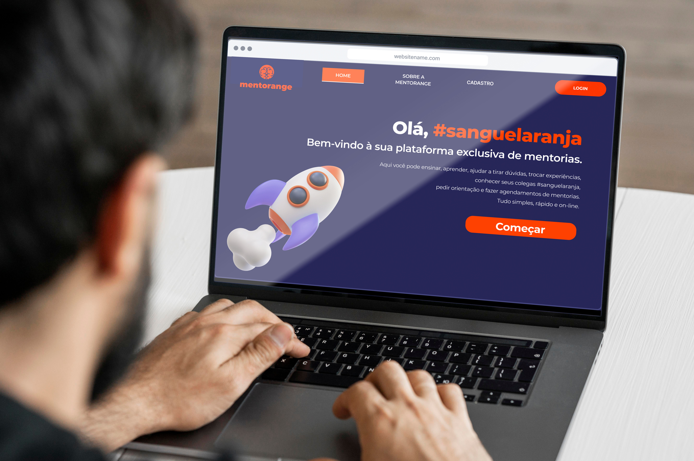

# MENT🍊RANGE - SQUAD 4
<h1 align="center">
    
</h1>

<ol>
        <li><a href="#sobre">Sobre</a></li>
        <li> <a href="#especificacoes">Especificações</a></li>
        <li> <a href="#comorodaroprojeto">Como Rodar o Projeto?</a> </li>
        <li> <a href="#resultados"> Resultados de Desenvolvimento</a> </li>
        <li> <a href="#features">Features</a> </li>
        <li> <a href="#conteudoxterno">Conteúdo externo</a></li>
    <li><a href="#licenca">Licença</a></li>
</ol>

<h2 id="sobre">Sobre</h2> 

O Mentorange foi um projeto desenvolvido pelo Squad 4 para o Hackathon do Programa de Formação da [FCamara](https://digital.fcamara.com.br/programadeformacao). 
O projeto tem como objetivo a construção de uma ferramenta que possibilite a empresa ter um sistema de mentorias online. No Mentorange, os consultores da empresa 
poderão agendar mentorias com seus colegas de trabalho com a finalidade de aprenderem cada vez mais sobre a tecnologia de seu interesse, 
escolhendo a skill de sua preferência. 

<h2 id="especificacoes">Especificações</h2> 

Utilizamos Node.js com Express para criar o backend da aplicação, codificado no sentido de repassar dados estáticos para consumo de uma API.
Essa integração entre backend e frontend foi realizada utilizando a biblioteca Axios, utilizamos também a possibilidade de autenticação utilizando JWT. 
Na estilização do frontend utilizamos CSS puro com bootstrap no intuito de termos mais flexibilidade para compor os layouts. O código foi criado a partir da biblioteca
React com o uso do javascript. Também utilizou-se o mongodb com banco e mongo atlas como cluster para armazenar os dados do banco.

<h2 id="comorodaroprojeto">Como rodar o projeto?</h2>

``` bash
#Clone este repositório
$ git clone https://github.com/ThalesAbdon/Technical-Share.git

#Abra a pasta backend e no terminal execute o comando:
$ npm install

#Em seguida deixe a aplicação executando através do comando abaixo:
$ npm start

#A aplicação (backend) será aberta na porta:5000 - acesse http://localhost:5000 

#Na pasta frontend abra o terminal e execute o comando:
$ yarn install

#Em seguida deixe a aplicação executando através do comando abaixo:
$ yarn start

#A aplicação(frontend) será aberta na porta:3000 - acesse http://localhost:3000 
```
*IMPORTANTE: Para que a aplicação funcione 100%, você deve deixar o back e o front rodando ao mesmo tempo.*

``` bash
#Abaixo estão os dados de teste para e-mail e senha necessários para navegação das telas:

email: MariaAlice@fcamara.com.br
senha: maria123

email: ArthurAndrade@fcamara.com.br
senha: arthur123

email: PatriciaNunes@fcamara.com.br
senha: patricia123

email: CarlosEduardo@fcamera.com.br
senha: carlos123

```

<h2 id="resultados">Resultados de Desenvolvimento</h2>

* Autenticação
* Criação de um calendário funcional
* Criação de um chat privado com acoplamento temporal mas desacoplado espacialmente
* Implementação do desing da interface com HTML,CSS e BOOTSTRAP usando os componentes do React
* Telas são Responsivas

[Detalhamento dos resultados](resultados-desenvolvimento.md)

<h2 id="features">Recursos</h2>

* No futuro o que pensamos em implementar...? 🤖
    * **01** - Mentoria ser realizada na própria plataforma(com vídeo ou áudio) 
    * **02** - Integração com o Google Agenda de relatórios de ocupação (acesso para o perfil de administrador)
    * **03** - Histórico de mentorias
    * **04** - Criação de cadastro(no Front)
    * **05** - Criação de acesso ao perfil completo(no Front).
 
<h2 id="conteudoxterno">Conteúdo Externo</h2> 

* 💻Quer saber as funcionalidades do nosso app? Basta assistir nosso [vídeo de funcionalidades](colocar link no youtube)!💻
* ✍🏻 Ah, não esqueça de ler o nosso [artigo](https://medium.com/@belterionath/mentorange-eafcd6af1beb) feito por nossa maravilhosa equipe de UX. ✍🏻
* 📺 Nosso [Pitch](https://www.youtube.com/watch?v=Vz9h-YlN8iI)! 📺

 

